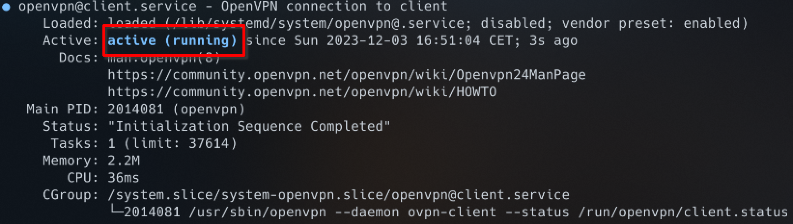

# Setting Up a Home Server: Static IP and Port Exposure with OpenVPN on Linux

Have you ever wished to run your own email server from the comfort of your home but were held back by the need for a
reliable static IP? There is a solution! Whether it's hosting a personal website, gaming server, or a
specialized application, this guide will show you how to set up a static IP and port exposure using OpenVPN on Linux.

!!! info "What if I already have a static IP?"
    This guide is intended for users that don't have a static IP address at home and want to expose a service on their 
    home network to the internet. If you already have a static IP address, you may not need this guide.

## Prerequisites
- :desktop: A hosted Linux server with a public IPv4 address
- :computer: A linux server at your home (e.g. Raspberry Pi)
- :thinking: A basic understanding of Linux and networking

## Overview

The basic idea is to set up a VPN server on your hosted Linux server and a VPN client on your home Linux server. The
VPN client will connect to the VPN server and expose the VPN server's IP address to the internet. This will allow you
to access your home server from the internet using the VPN server's IP address.   
A nice side effect of this setup is that your actual home IP address will be hidden from the internet.


## :desktop: Setting up the VPN Server

This process is fairly straightforward. We will be using the [OpenVPN-Install](https://github.com/angristan/openvpn-install)
script to set up the VPN server. This script will install and configure OpenVPN on your server. It will also generate
a client configuration file that you will need to copy to your home server.

1. SSH into your hosted Linux server
2. Install curl (if not already installed)
    ``` bash
    sudo apt update && apt install curl -y
    ```
3. Ensure you are in the `/root` directory:
    ``` bash
    cd /root
    ```
4. Download the OpenVPN-Install script and make it executable:
    ``` bash
    curl -O https://raw.githubusercontent.com/angristan/openvpn-install/master/openvpn-install.sh
    chmod +x openvpn-install.sh
    sudo AUTO_INSTALL=y ./openvpn-install.sh
    ```
5. Create a client configuration file by running the following command:
    ``` bash
    sudo ./openvpn-install.sh
    ```
    Type `1` and press `Enter` to create a new client. You will be prompted to enter a name for the client. Enter a name
    of your choice and press `Enter`. Now type in `1` again and press `Enter` to confirm everything. The script will 
    generate a client configuration file and save it to `/root/<client-name>.ovpn`. You will need to copy this file 
    to your home server in the next step.

## :computer: Setting up the VPN Client

1. SSH into your home Linux server and install OpenVPN:
    ``` bash
    sudo apt update && apt install openvpn -y
    ```
2. Copy the client configuration file from your hosted Linux server to your home Linux server. You can use `scp` to
    copy the file:
     ``` bash
     scp root@<hosted-server-ip>:/root/<client-name>.ovpn /etc/openvpn/client.conf
     ```
3. Start the OpenVPN service:
    ``` bash
    sudo systemctl start openvpn@client
    ```
4. Check the status of the OpenVPN service:
    ``` bash
    sudo systemctl status openvpn@client
    ```
    You should see something like this:
    
5. Enable the OpenVPN service to start on boot:
    ``` bash
    sudo systemctl enable openvpn@client
    ```
6. Check your public IP address:
    ``` bash
    curl ifconfig.me
    ```
    You should see the IP address of your hosted Linux server. This means that your home Linux server is now connected
    to your hosted Linux server via the VPN server.

## :twisted_rightwards_arrows: Setting up port forwarding

Now that your home Linux server is connected to your hosted Linux server via the VPN server, you can expose any port
on your home Linux server to the internet. This is done by setting up port forwarding on your hosted Linux server.

First, you need to find out the IP address of your home Linux server. You can do this by running the following command
on your hosted Linux server:
``` bash
cat /etc/openvpn/ipp.txt | cut -d ',' -f 2
```

This is the IP address of your home Linux server. You can now set up port forwarding on your hosted Linux server to
expose any port on your home Linux server to the internet.

To make the setup easier, we are going to set an environment variable with the IP address of your home Linux server:
``` bash
export HOME_IP=<home-server-ip> # Replace <home-server-ip> with the IP address of your home Linux server
export STATIC_IP=<static-ip> # Replace <static-ip> with the static IP address of your hosted Linux server
```

First, you need to enable IP forwarding on your hosted Linux server. Replace `eth0` with the name of your network
interface:
``` bash
sudo sysctl -w net.ipv4.ip_forward=1
sudo iptables -t nat -A POSTROUTING -o eth0 -j MASQUERADE
```

You can use the following commands to set up port forwarding on your hosted Linux server:

### :globe_with_meridians: Exposing a TCP port
``` bash
PORT=<port>; sudo iptables -t nat -d $STATIC_IP -A PREROUTING -p tcp --dport $PORT -j DNAT --to-destination $HOME_IP:$PORT
```

### :globe_with_meridians: Exposing a UDP port
``` bash
PORT=<port>; sudo iptables -t nat -d $STATIC_IP -A PREROUTING -p udp --dport $PORT -j DNAT --to-destination $HOME_IP:$PORT
```

### :earth_africa: Exposing a range of TCP ports
``` bash
START_PORT=<start-port> END_PORT=<end-port>; sudo iptables -t nat -d $STATIC_IP -A PREROUTING -p tcp --dport $START_PORT:$END_PORT -j DNAT --to-destination $HOME_IP:$START_PORT-$END_PORT
```

### :earth_africa: Exposing a range of UDP ports
``` bash
START_PORT=<start-port> END_PORT=<end-port>; sudo iptables -t nat -d $STATIC_IP -A PREROUTING -p udp --dport $START_PORT:$END_PORT -j DNAT --to-destination $HOME_IP:$START_PORT-$END_PORT
```

### :information_source: Example: Exposing a web server on port 80
``` bash
PORT=80; sudo iptables -t nat -d $STATIC_IP -A PREROUTING -p tcp --dport $PORT -j DNAT --to-destination $HOME_IP:$PORT
```

## :floppy_disk: Making the iptables rules persistent
The iptables rules are not persistent by default. This means that if you reboot your hosted Linux server, the iptables
rules will be lost. To make the iptables rules persistent, you need to install the `iptables-persistent` package:
``` bash
sudo apt update && apt install iptables-persistent -y
```

During the installation, you will be asked if you want to save the current iptables rules. Type `yes` and press `Enter`
to save the rules. The iptables rules will now be loaded automatically on boot.

## :tada: Conclusion

Congratulations! You have successfully set up a static IP and port exposure using OpenVPN on Linux. You can now access
any service on your home Linux server from the internet using the IP address of your hosted Linux server.